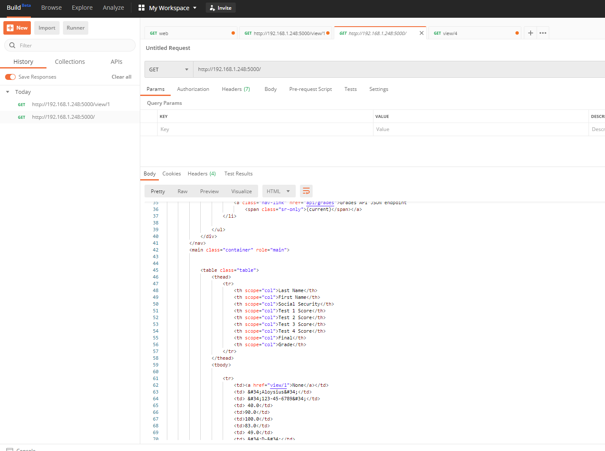
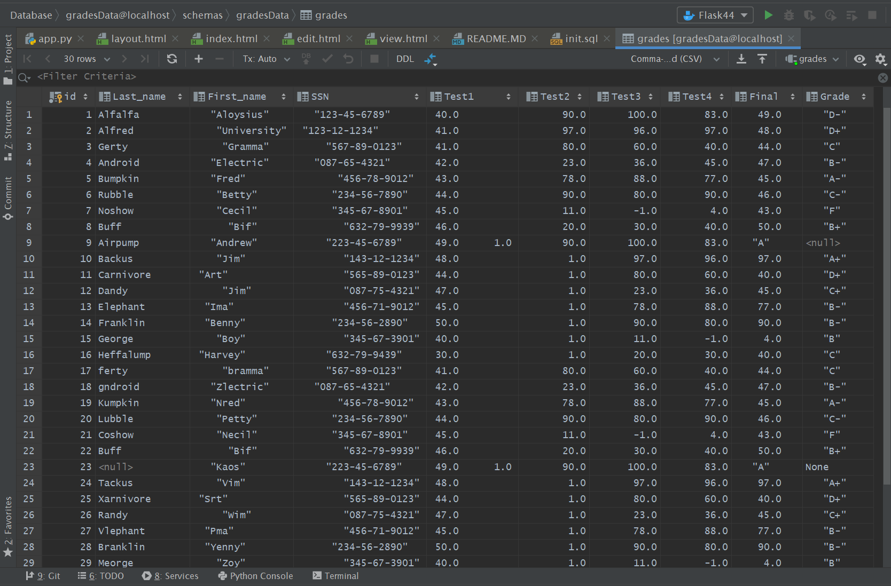
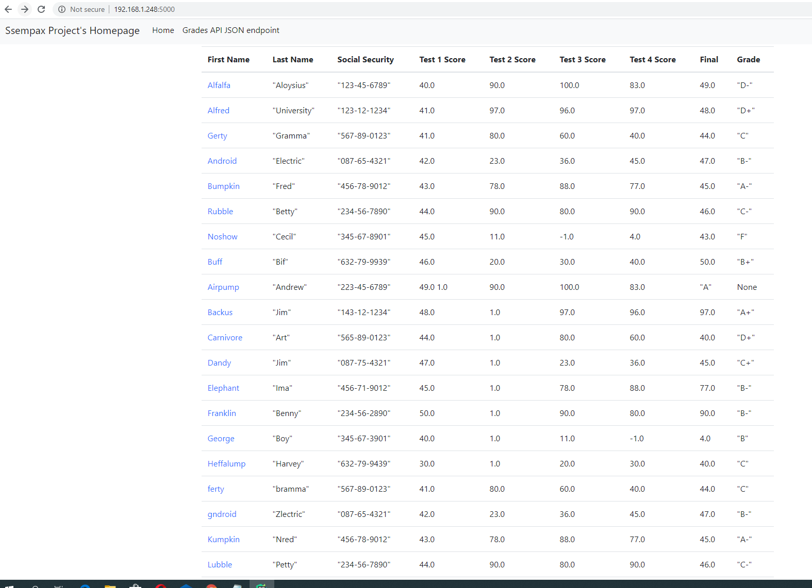

# Project Description
This project is a homework assignment to teach how to get Pycharm setup with Docker, Flask , Mysql
## Post Screenshots

## Query Screenshots

## Flask bootstrap Data Screenshots 
